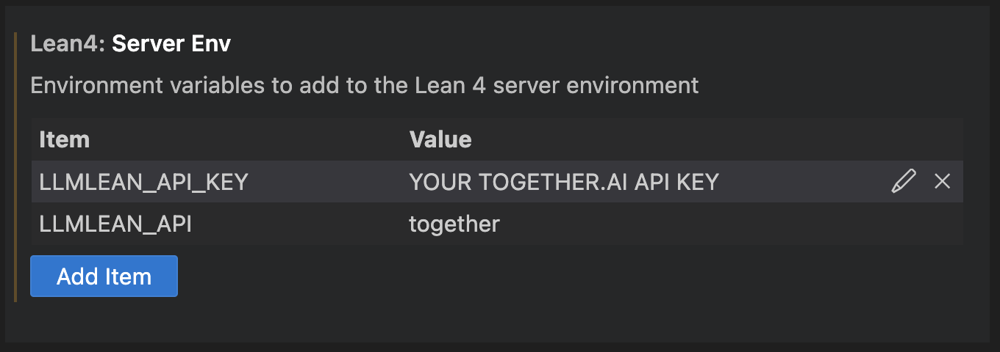

# LLMLean

#### LLM on your laptop:
1. Install [ollama](https://ollama.com/).

2. Pull a language model:
```bash
ollama pull solobsd/llemma-7b
```

3. Add `llmlean` to lakefile:
```lean
require llmlean from git
  "https://github.com/cmu-l3/llmlean.git"
```

4. Import:
```lean
import LLMlean
```
Now use a tactic described below.

#### LLM in the cloud:

1. Get a [together.ai](https://www.together.ai/) API key.

2. Set 2 environment variables in VS Code. Example:



Then do steps (3) and (4) above. Now use a tactic described below.

----
### `llmstep` tactic
Next-tactic suggestions via `llmstep "{prefix}"`. Examples:

- `llmstep ""`

  

- `llmstep "apply "`

  

---------------

## Customization

Please see the following:
1. [Customization](docs/customization.md)
