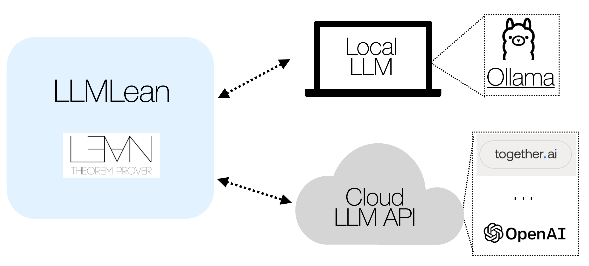
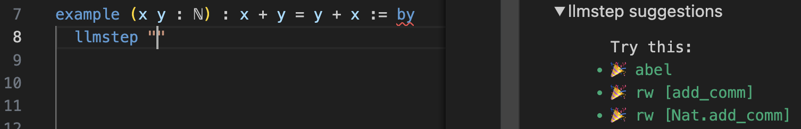
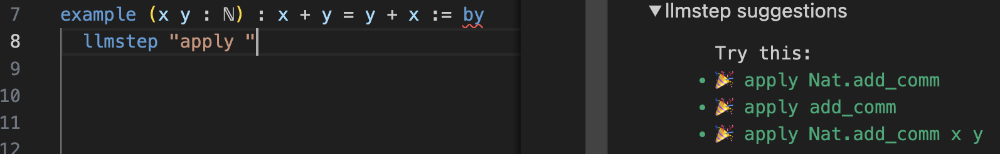
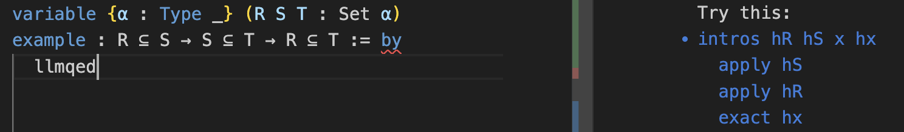
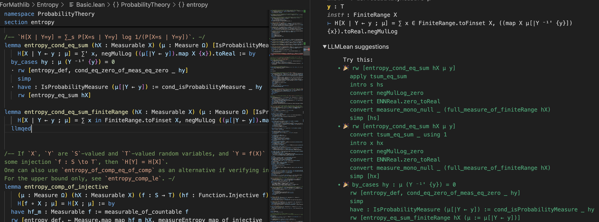
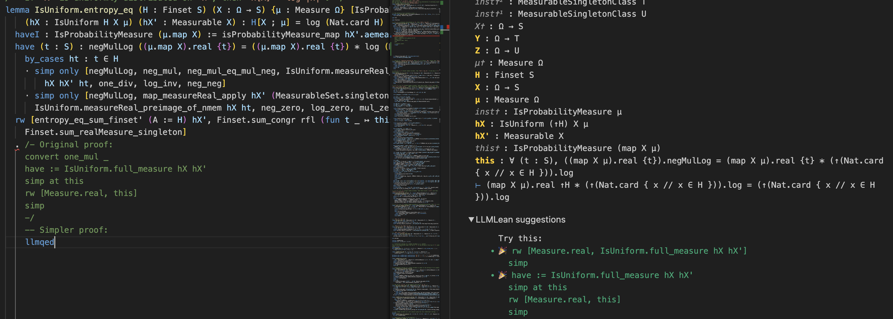

# LLMLean

LLMlean integrates LLMs and Lean for tactic suggestions, proof completion, and more.

## News

- **06/2025**: Introduced iterative refinement mode for proof generation
- **06/2025**: Added support for [Kimina Prover](https://arxiv.org/abs/2504.11354) models via Ollama (thanks to @BoltonBailey)

Here's an example of using LLMLean on problems from [Mathematics in Lean](https://github.com/leanprover-community/mathematics_in_lean):

https://github.com/user-attachments/assets/284a8b32-b7a5-4606-8240-effe086f2b82

You can use an LLM running on your laptop, or an LLM from the Open AI API or Together.ai API:



#### LLM in the cloud (default):

1. Get an [OpenAI API](https://openai.com/index/openai-api/) key.

2. Modify `~/.config/llmlean/config.toml` (or `C:\Users\<Username>\AppData\Roaming\llmlean\config.toml` on Windows), and enter the following:

```toml
api = "openai"
model = "gpt-4o"
apiKey = "<your-openai-api-key>"
```

(Alternatively, you may set the API key using the environment variable `LLMLEAN_API_KEY` or using `set_option llmlean.apiKey "<your-api-key>"`.)

You can also use other providers such as Anthropic, Together.AI, or any provider adhering to the OpenAI API. See [other providers](docs/other_providers.md).

3. Add `llmlean` to lakefile:
```lean
require llmlean from git
  "https://github.com/cmu-l3/llmlean.git"
```

4. Import:
```lean
import LLMlean
```

Now use a tactic described below.
#### Option 2: LLM on your laptop:
1. Install [ollama](https://ollama.com/).

2. Pull a language model:
```bash
ollama pull wellecks/ntpctx-llama3-8b
```

3. Set 2 configuration variables in `~/.config/llmlean/config.toml`:

```toml
api = "ollama"
model = "wellecks/ntpctx-llama3-8b" # model name from above
```

Then do steps (3) and (4) above. Now use a tactic described below.

Note that there are multiple Lean models available for download from Ollama, including [Kimina Prover](https://arxiv.org/abs/2504.11354) models which use chain-of-thought reasoning. You can find a list of these models and how to configure them in the [Ollama Models](docs/ollama-models.md) document.


## Tactics
### `llmstep` tactic
Next-tactic suggestions via `llmstep "{prefix}"`. Examples:

- `llmstep ""`

  

- `llmstep "apply "`

  

The suggestions are checked in Lean.

### `llmqed` tactic
Complete the current proof via `llmqed`. Examples:

- 


The suggestions are checked in Lean.

### Proof Generation Modes

LLMLean supports two modes for proof generation with `llmqed`:
- **Parallel mode**: Generates multiple proof attempts in parallel
- **Iterative refinement mode**: Generates one proof attempt, analyzes any errors, and refines the proof based on feedback

To configure:
```toml
# In ~/.config/llmlean/config.toml
mode = "iterative"  # or "parallel"
```

Enable verbose output to see the refinement process:
```lean
set_option llmlean.verbose true
```

*For the best performance, especially for the `llmqed` tactic, we recommend using Anthropic Claude with iterative refinement mode.*


## Demo in [PFR](https://github.com/teorth/pfr)

Here is an example of proving a lemma with `llmqed` (OpenAI GPT-4o):



And using `llmqed` to make part of an existing proof simpler:




## Customization

Please see the following:
- [Customization](docs/customization.md)


## Testing
Tests are under the `LLMleanTest` subdirectory.
Make sure the versions are the same between `lakefile.lean` and `lean-toolchain` in the root directory and the `LLMleanTest` directory, and then run:
```sh
cd LLMleanTest
lake update
lake build
```
Then manually try running `llmqed`/`llmstep` on the files under `LLMleanTest`.
