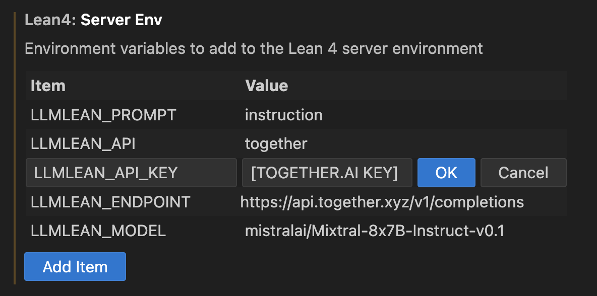

### Environment variables

The following environment variables let you customize LLMLean.

#### LLM in the cloud
Example:

- `LLMLEAN_API`:
  - `together` : to use Together API (or your own server)
- `LLMLEAN_API_KEY`:
  - [API key](https://api.together.xyz/settings/api-keys) for Together API
- `LLMLEAN_ENDPOINT`: API endpoint
  - `https://api.together.xyz/v1/completions` for Together API
- `LLMLEAN_PROMPT`:
  - `fewshot` :  for base models
  - `instruction` : for instruction-tuned models 
- `LLMLEAN_MODEL`:
  - Example for Together API: `mistralai/Mixtral-8x7B-Instruct-v0.1`
 

#### LLM on your laptop
- `LLMLEAN_API`:
  - `ollama` : to use ollama (default)
- `LLMLEAN_ENDPOINT`: 
  - With ollama it is `http://localhost:11434/api/generate` (default)
- `LLMLEAN_PROMPT`:
  - `fewshot` :  for base models (default)
  - `instruction` : for instruction-tuned models
- `LLMLEAN_MODEL`:
  - Example: `solobsd/llemma-7b` (default) 

### Setting environment variables
To set environment variables in VS Code, go to:

- Settings (`Command` + `,` on Mac)
- Extensions -> Lean 4
- Add the environment variables to Server Env. 

Then restart the Lean Server (`Command` + `t`, then type `> Lean 4: Restart Server`).
